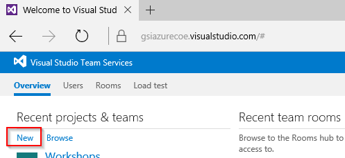
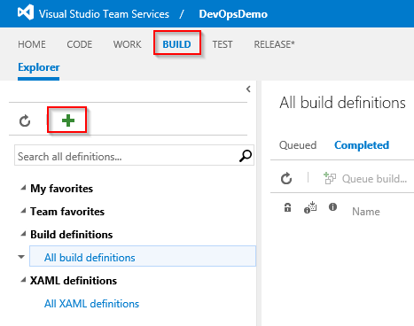
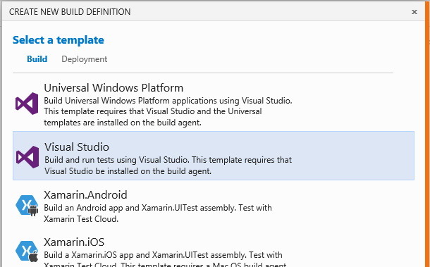

# DevOps Introduction
This guide provides an introduction to some Visual Studio and Azure integration concepts.  In this demonstration you will show how to 
* Push changes from a local Git repository to Visual Studio Team Services
* Enable continuous integration (build) in VSTS

## Contents
* [Pre-Requisites](#pre)
* [Setup](#setup)
* [Demo Steps](#demo)
* [Clean Up](#clean)

##  Pre-Requisites
*Estimated Setup Time: 45 minutes*

1.	Navigate to the VSTS online portal (PORTALNAME.visualstudio.com)	

2.	Create a new project by clicking the "New" button under "Recent Projects & Teams".
Give the project a name, set its version control to Git, and complete the project setup.
When finished navigate to the newly created project landing page.	 

    

    

3.	From the project landing page click "Open in Visual Studio"	 

    

4.	Clone the repository from VSTS to your local machine by selecting a folder on your local hard drive	 

    

5.	Now that we have our repository cloned locally we need code. On the Home tab of the Team Explorer, add a new solution

    

6.	From the "Installed" section, select Templates – Visual C# - Web and then click on "ASP.NET Web Application". Give the solution a name, and deselect the box for Application Insights	 

    

7.	Use the MVC template (1) while adding unit tests (2), setting authentication to "No Authentication" (3), and deselecting the box to Host in the Cloud (4). Then select OK to provision the solution.	 

    

8.	Open Index.cshtml from the WebApplication project and adjust the title to "Azure"	 

    

9.	Check in our new solution to the local repository by right clicking the solution and selecting "Commit"	 

    

10.	Under the "Excluded Changes" section, right click and select "Include" on .gitignore and .gitattributes to ensure they are added	 

    

11.	Give a comment and click the small arrow on the right side of the "Commit" button to drop down additional options.  Then click "Commit & Push" to push the changes to VSTS	 

    

12.	Verify that the solution is visible in the Code tab of VSTS	 

    

13.	Now that we have code in the cloud, we need to setup environments to be used in deployments. We’ll deploy an ARM template to Azure with a couple of web apps. Open up the DevOps Visual Studio solution that accompanies this document and locate the ARMTemplate project	 

    

14.	Right click on the project, hover on "Deploy" and select "New Deployment"	 

    

15.	Select your Azure Subscription, provide a location for the resource group near where the demo will take place, and select "Edit Parameters"	 

    

16.	In the Edit Parameters dialog, give the demo a name. An easy option is the city of your demo, concatenated with the MMDD. This name is used for the web applications and hosting plans. When finished, deploy the template	 

    

17.	Verify that the deployment succeeded and that the web apps are visible via the browser	 

    

    

    

18.	Now that we have a code repository, and target web apps to deploy towards, let’s work on a Build definition.  Click on the "Build" tab in VSTS and select the green "+" sign	 

    

19.	Since we’ve been working with Visual Studio, go ahead and select the Visual Studio Template. 	 

    

20.	On the Settings dialog leave everything as is and click "Create"	 

    

21.	This template pre-bakes the steps that we need for a build. However, since we will be deploying to a web app, we’ll need a web deployment package.  To generate this .zip file, we need to adjust the MSBuild Arguments from the first step to include: `/p:DeployOnBuild=true /p:WebPublishMethod=Package /p:PackageAsSingleFile=true /p:SkipInvalidConfigurations=true /p:PackageLocation="bin\deploymentpackage"`. Click Save and give your Build definition a title, ex. "BuildApplication"

    

22.	Queue a new build and verify that the build completes successfully. Clicking the "Artifacts" tab will give you the option to Explore files generated during the build, including our deployment package located at 	 

    

    

    

23.	With our Build definition completed, time to generate a Release definition. Click the "Release" tab and select the "+" icon.

    

24.	Select the "Azure Website Deployment" template and click "OK"	 

    

25.	Give the definition a name (1) and establish a link to the build definition we setup previously	 

    

26.	Before deploying we need to setup a service endpoint connection to Azure. Click the "Manage" link to launch the VSTS Control Panel 	 

    

27.	On the Control Panel, click the "+ New Service Endpoint" dropdown and select "Azure"	 

    

28.	Select the radio button for "Certificate Based" and fill in a name for the Connection Name. From `http://portal.azure.com` navigate to the "Subscriptions" blade and copy your Subscription ID into the VSTS dialog.

    

29.	Navigate to `https://manage.windowsazure.com/publishsettings` in a browser window. This should kickoff a download of a .publishsettings file. Open it in Notepad and copy the values from Name="" and ManagementCertificate="" into the VSTS boxes	 

    

30.	When all boxes are filled out, click "OK" in the dialog to finish setting up the connection to Azure	 

    

31.	Back in VSTS’ Release tab, you should be able to click the refresh icon and then select your Azure Subscription in the dropdown	 

    

32.	For Web App Name, choose the name and location of the "*–test" application that we deployed with the ARM template (the dropdown box doesn’t always populate correctly)	 

    

    
 
33.	Earlier we created a web deployment package in the Build step’s Artifacts. We need to select that .zip file in the Web Deploy Package heading’s file picker. This is what we’ll deploy to the Azure Web App	 

    

    
 
34.	Finally, rename the environment to "Test" since we are deploying to a test web application	 

    

35.	With our test environment configured, we now need to setup a second environment for production Click the "+ Add environments" and select the "Azure Website Deployment" template.	 

    

36.	Name the new deployment "Staging", select the Azure Subscription we created earlier. For the Web App Name, input the other web app created by the ARM Template (without the –test) name. For the slot, type in "Staging" since that was the name of the slot deployed via the ARM template. Finally, select the same Web Deploy Package .zip file as before via the file picker	 

    

    

37.	Save the Release Definition

    

38.	Generate a new release by clicking the "+ Release" dropdown and then "Create Release"	 

    

39.	Select the latest Build from the dropdown, and click on both environments	 

    

40.	Verify the releases succeed	 

    

    

    

41.	In the Azure Portal, Swap the staging slot into production and verify success	 

    

    

Our web app is now visible in the production site, and the test site, however after the swap our staging slot is now the starter template. Kick off one more release to re-deploy the app into test and staging, ensuring that all 3 URLs identically show our starter web application

Finally, load into browser tabs the "Home" page of your VSTS project, and all 3 of the web applications (demoname, demoname-staging, demoname-test). Also open Visual Studio 2015 with the web application open.

Setup Completed.

##  Demo Steps
*Estimated Time: 8 minutes*

1.	Starting from the "Home" tab of the VSTS portal, describe the concept of the dashboard and how it can be customized for your development team in a variety of ways

    

2.	Open the "Code" tab and show that we have an existing web application that the team is working on. 

    

3.	Flip through the 3 open sites to show each environment: demoapp, demoapp-staging, and demoapp-test. Mention that the page title of "Azure" doesn’t pop enough, and that there’s room to improve it.

    

4.	Back on the "Code" tab, click the "Clone" button and show the options for getting the code onto your personal machine.  Mention that devs more comfortable with the command line can pull the URL down as given, while developers that prefer Visual Studio can click the "Clone in Visual Studio" button. 

    

5.	Switch to Visual Studio where the solution is already open.  Once here, open the index.cshtml file

    

6.	Adjust the title by replacing "Azure" with some cloud icons: `<i class="glyphicon glyphicon-cloud"></i> Azure <i class="glyphicon glyphicon-cloud"></i>`. 

    

7.	Mention now that we’ve made the change locally, we need to push that change back up to the server. Right click on the index.cshtml file and click "Commit"

    

8.	Enter a comment for the checkin, then click the dropdown arrow next to the Commit button and select "Commit and Sync"

    

9.	In the browser, refresh the "Code" tab to show that the server has the new code

    

10.	Now that our changes have been made on the server, we need to build those changes.  Switch over to the "Build" tab and click the "+" button to show some of the available templates

    

11.	Cancel out of the new build definition dialog window and open the existing "BuildApplication" definition that was previous setup

    

12.	Describe the pipeline and how our build is setup with a series of steps.  Click on "+ Add Build Step" 

    

13.	Discuss the vast array of tasks that are available for a variety of technologies. MSBuild, Ant, Maven, NPM, Grunt, Gulp, and more are all built right into the platform

    

14.	Any activity that can be done in a console can be integrated into our build pipeline. Show the "Utility" tab and the script tasks

    

15.	Recently VSTS has expanded into a marketplace format where ISV’s, partners, and the larger community can create custom tasks.  Open the marketplace and browse the options, such as RedGate and Octopus
](media/image066.png)

    

16.	Back on our prebuilt Build definition, click the "Triggers" tab.  Traditionally setting up a nightly build, or continuous integration has been difficult. With TSVS we allow you to build on code checkin, or define a schedule. For example, setup builds nightly during the week but not on the weekends.

    

17.	Clicking back to the Build tab, click the "Queue Build" button to kickoff a new build. Discuss how each action in our pipeline has full logging, so we can watch throughout the process.  Our build is being done in the cloud via a set of build servers, but we can also integrate into existing, on-premises servers if desired. If the build is not picked up off the queue within 60 seconds, switch back to slides and move forward, saying you’ll revisit when the build finishes

    

18.	With the completed build, showcase the Test Results section, code coverage, and Build details

    

19.	Close by recapping that we were able to clone down a Git repository from the cloud, edit the code base, push those changes back to the server, and run a custom build process on that code.  That process can be started manually, as we demonstrated, on a set schedule, or continually on code checkin.

Demo completed.

##  Clean Up
To clean up this environment delete the Azure resource group and VSTS project you created in the Setup section.
