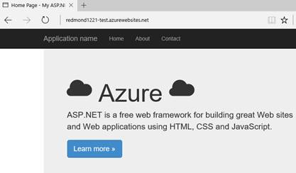

# DevOps Introduction
This guide provides information on how to release code to a variety of environments with the VSTS Release Management system, including integration with Web App Deployment Slots
* Create release definition 
* Deploy application to test and staging environments
* Swap staging slot into production

## Contents
* [Pre-Requisites](#pre)
* [Setup](#setup)
* [Demo Steps](#demo)
* [Clean Up](#clean)

## Pre-Requisites
This section lists the pre-requisites required for this demonstration.
* Azure subscription
* Visual Studio Team Services (VSTS) project

##  Setup

1.	Ensure you have completed the intro demo as this demo is a continuation.

Setup Completed.

##  Demo Steps
*Estimated Time: 8 minutes*

1.	At the end of the intro video we had successfully build code in VSTS. Start by showing this completed build as a reminder

    

2.	Click the "Release" tab and then the "+" sign. The Release Management tools are built to be similar to the build tools we showed before, so much of the UI and process should look familiar. 

    Here we’ve started to setup a new release definition, and can see the prebuilt templates that we can start from.  As always we can opt for a blank definition file.  

    While closing this dialog window, mention that we have already setup a release definition. Select the Release Application from the left bar.

    

3.	Since the releases take longer, go ahead and kickoff a manual release via the "+ Release" button.  Say that we’ll come back to that in a moment.

    In the Build Definition tasks, open up the "+ Add tasks" dialog to show again the out of the box tasks available for release pipelines.  Under the "Test" section show the "Cloud Based Load Test" as an option that we can automatically run against a test environment before our QA team even touches the keyboard

    

4.	Closing the dialog, point out that we are deploying to two separate environments: "Test" and "Staging".  Each of these is a separate Azure web app running on a separate app hosting plan.  

    By default our release will deploy to Test, and then immediately to Staging. However, we often want to wait to deploy to Staging depending on how our application looks in Test. Click the 3 dots on the top right corner of our "Test" environment and select "Assign Approvers"

    

5.	Deselect the "Automated" box by "Post-deployment approver".  Choose another workshop presenter (who is in the MSFT AD) and input them as an approver. Mention that for this demo we want to make sure Israel approves our work in Test before we proceed with the release.  We can also choose a group if we wanted to allow groups of approvers, such as our QA team. Select OK

    

6.	Click back on the title ReleaseApplication to check on the release progress.  Click on "Logs" to again show the granular logging for each step in the release pipeline.    

    

7.	When the release is finished, switch browser tabs and refresh the test environment web app to show the updated title

    

8.	If the release has finished deploying to staging, also show the staging site.  Mention that to get the app all the way into production, we need to execute a deployment slot swap

    

9.	In the Azure Portal, open the production web app and click "Swap"

    

10.	Setup staging as the source, with production as the destination and click OK

    

11.	In ~30 seconds your slots should be swapped, and the production app now shows our updated title. If there were any issues, we could easily swap back and the previous code would be back in production with zero downtime

    

12.	Recap that we were able to take a build of our application and using a custom release definition, deploy that code into two environments.  First we deployed into Test, where we can run cloud based load tests, validate the changes with our QA department, and then receive signoff from a supervisor and/or team.  Next we deployed the same code into our production staging slot.  In that slot we warmed up the web app and looked for any last minute issues, before executing a swap. This swap moved the updated code into production with zero downtime.  The entire process could be setup automatically, or chunked up to match our devops process.

Demo completed.

##  Clean Up
To clean up this environment delete the Azure resource group and VSTS project you created in the Setup section.
