This guide provides an introduction to some Visual Studio and Azure integration concepts. In this demonstration you will show how to:

-   Push changes from a local Git repository to Visual Studio Team Services

-   Enable continuous integration (build) in VSTS

While certain tasks should be demonstrated as a live demo, it is a good practice to go through the full process before the live demo, giving you the opportunity to go back to a working setup, as well as not wasting time during the live demo while waiting for the actual pre-configuration, build and release processing.

Pre-Requisites
--------------

This section lists the pre-requisites required for this demonstration.

-   Azure Subscription

-   Visual Studio Team Service account (VSTS)

-   Visual Studio 2015

Setup the Azure App Service Plan and WebApps
--------------------------------------------

**Note: This step should always be completed before starting the live demo. It basically shouldn’t be part of the live demo itself, but depends on the overall session setup. (ARM template deployment is normally covered in the ARM End-to-End session before).**

In this section, you will use a pre-configured ARM template to populate the App Service Plan and WebApp as Azure Resources.

-   Open the ARM template in Visual Studio

-   Deploy the Arm template to a new Resource Group and updated deployment parameters

*Estimated time: 15 minutes*

| 1.  Navigate to the CODE directory in the Workshops folder containing the DevOps session content | 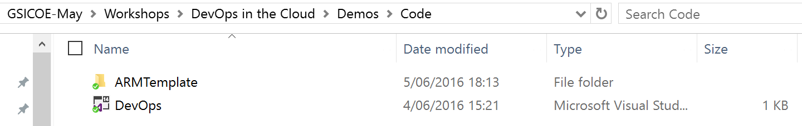  |
|--------------------------------------------------------------------------------------------------|-----------------------------------------------------------|
| 1.  Open the DevOps Visual Studio Project in Visual Studio                                       | 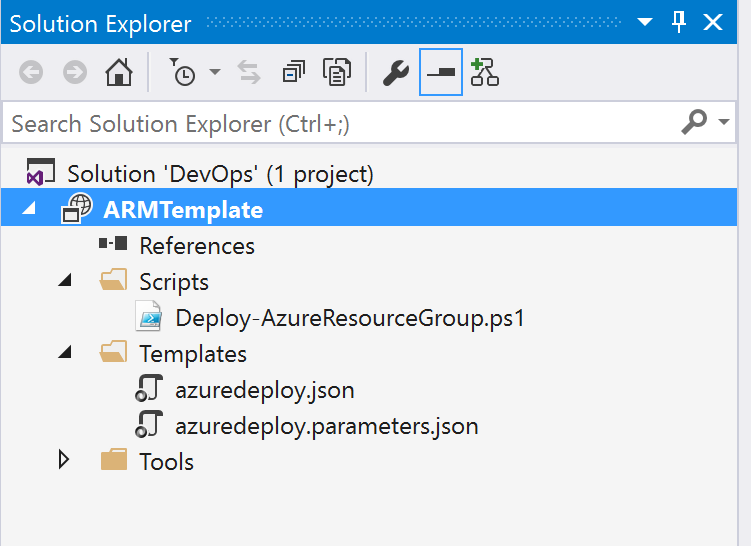 |
| 1.  RightClick the **ARMTemplate,** select Deployment / New Deployment                           | 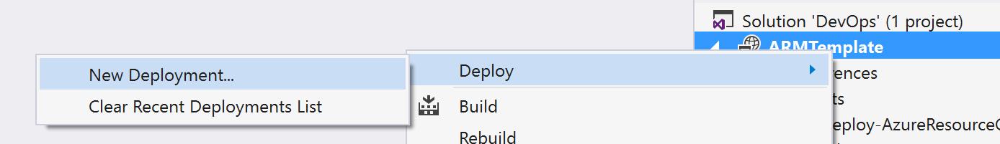  |

| 1.  Complete the deployment parameters as per the screenshot example:                            
                                                                                                   
 -   New Resource Group (eg. DevOpsDemo)                                                           
                                                                                                   
 -   Resource Group Location (closest to where you are based to avoid latency)                     
                                                                                                   
 -                                                                                                 | 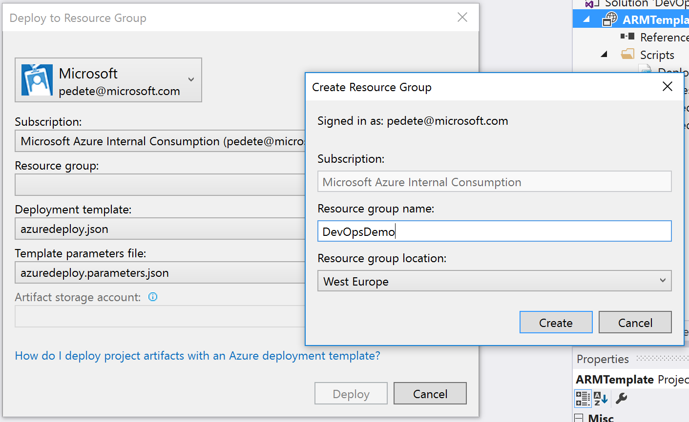 |
|--------------------------------------------------------------------------------------------------|-----------------------------------------------------------|
| 1.  Edit de **parameters** for the Template Parameters File as per the screenshot example        | 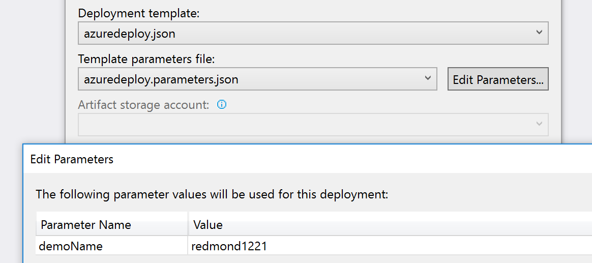 |
| 1.  Deploy this template. You can verify the deployment task in the Visual Studio Output window. | 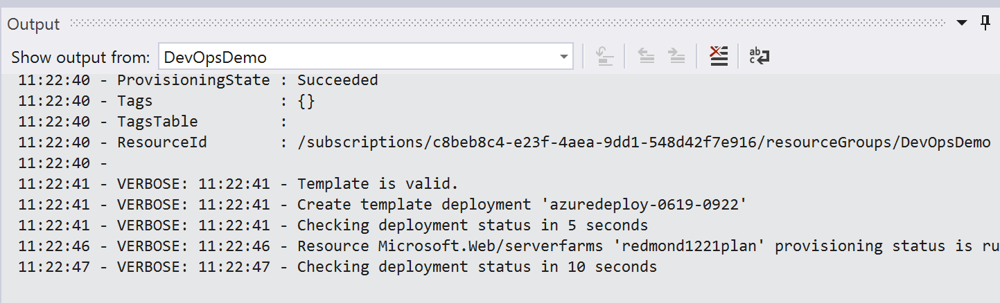 |

| 1.  Verify the Resource Group and resources have been created successfully from the Azure Portal | 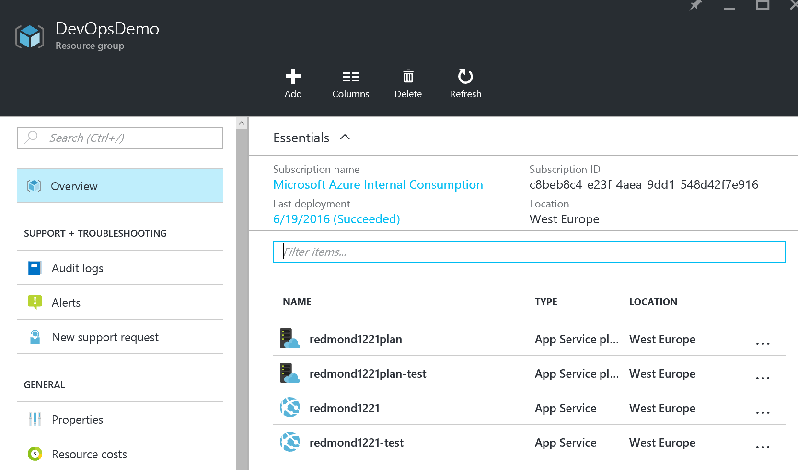 |
|--------------------------------------------------------------------------------------------------|-----------------------------------------------------------|
|                                                                                                  |                                                           |

This completes the creation of an Azure Resource Group, in which you deployed 2 App Service Plans and 2 WebApps, that will be used later on in the next part of the demo.

Setup the Visual Studio Team Services Project Repository
--------------------------------------------------------

*Estimated time: 15 minutes*

**Note: This step should always be completed before starting the live demo. Depending on the session setup, this could be shown as a live demo too. (Depending on the internet connection speed, uploading the local changes back to VSTS might take up to 10min – that’s why we encourage to complete these steps already before doing the live demo)**

In this section, you will create a new Visual Studio Team Services project online, which will be used for the Continuous Integration and Deployment demos later on.

-   Create a new Visual Studio Team Services project online

-   Deploy a new Web ASP.NET application

-   Upload changes to VSTS

| 1.  Navigate to the VSTS online portal (PORTALNAME.visualstudio.com)                               |                                                            |
|----------------------------------------------------------------------------------------------------|------------------------------------------------------------|
| 1.  Create a new project by clicking the “New” button under “Recent Projects & Teams”.             
                                                                                                     
 -   Give the project a name, set its version control to Git, set the Shared with to ‘team members’  
                                                                                                     
 -   and complete the project setup.                                                                 
                                                                                                     
     When finished, navigate to the newly created project landing page.                              | 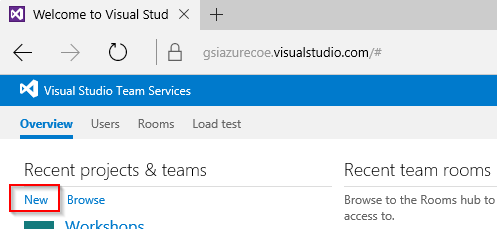  
                                                                                                                                                                  
                                                                                                      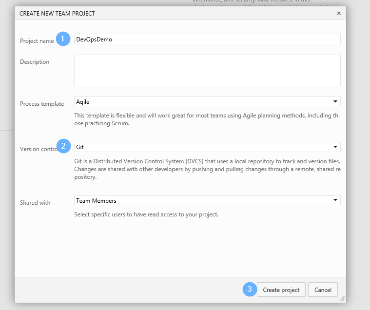   |
| 1.  From the project landing page click “Open in Visual Studio”                                    | 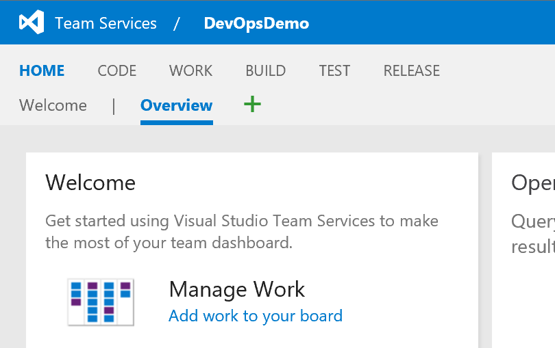 |

| 1.  Clone the repository from VSTS to your local machine by selecting a folder on your local hard drive                                                        | 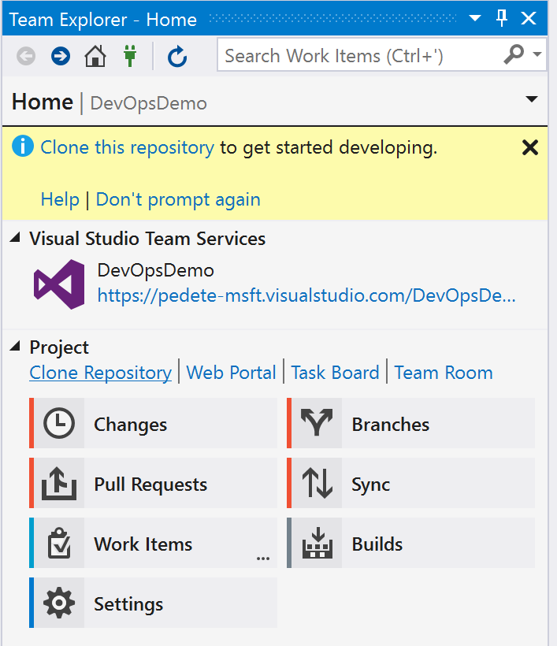 
                                                                                                                                                                                                                              
                                                                                                                                                                  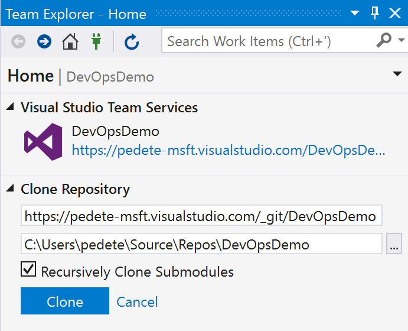  |
|----------------------------------------------------------------------------------------------------------------------------------------------------------------|------------------------------------------------------------|
| 1.  Now that we have our repository cloned locally we need code.                                                                                               
                                                                                                                                                                 
     On the Home tab of the Team Explorer, add a new solution                                                                                                    | 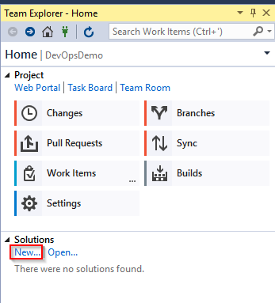 |
| 1.  From the “Installed” section, select Templates – Visual C\# - Web and then click on “ASP.NET Web Application”                                              
                                                                                                                                                                 
     Give the solution a name, and deselect the box for Application Insights                                                                                     | 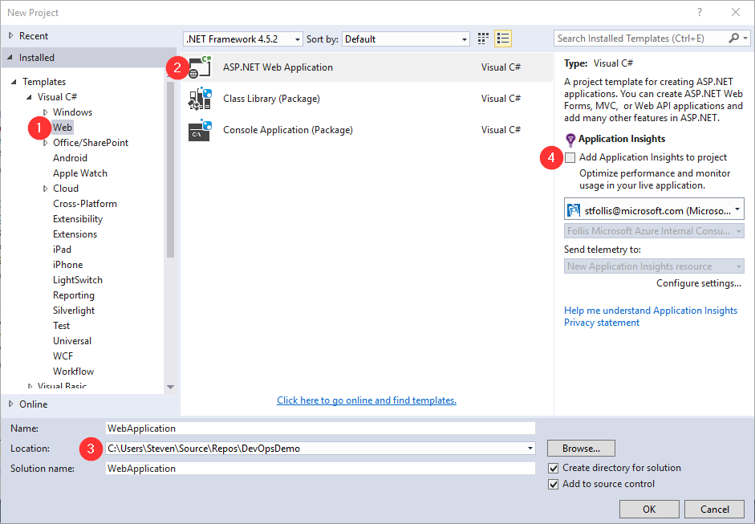 |
| 1.  Use the MVC template (1) while adding unit tests (2), setting authentication to “No Authentication” (3), and deselecting the box to Host in the Cloud (4). 
                                                                                                                                                                 
     Then select OK to provision the solution.                                                                                                                   | 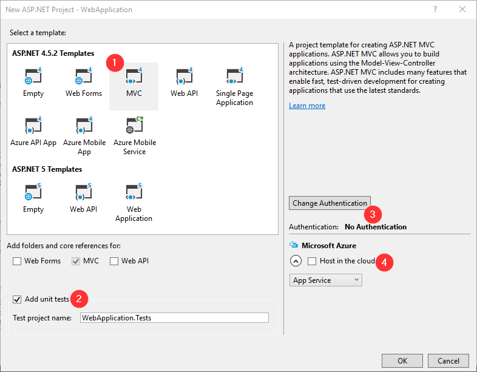 |

| 1.  Open Index.cshtml from the WebApplication project and adjust the title                                  
     &lt;h1&gt;ASP.NET&lt;/h1&gt; to “&lt;h1&gt;Azure GSI DevOps Demo&lt;/h1&gt;”                             
                                                                                                              
 -   Save the changes                                                                                         | 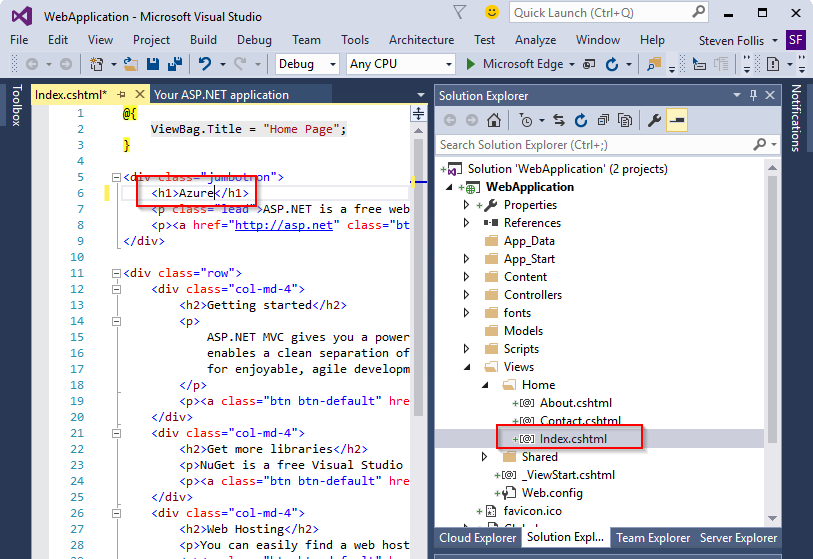 |
|-------------------------------------------------------------------------------------------------------------|------------------------------------------------------------|
| 1.  Check in our new solution to the local repository by right clicking the solution and selecting “Commit” | 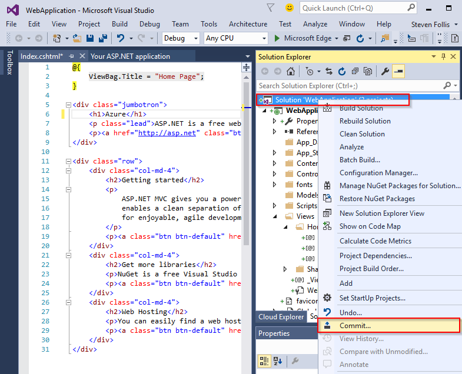 |

| 1.  Give a comment and click the small arrow on the right side of the “Commit” button to drop down additional options. Then click “Commit & Push” to push the changes to VSTS | 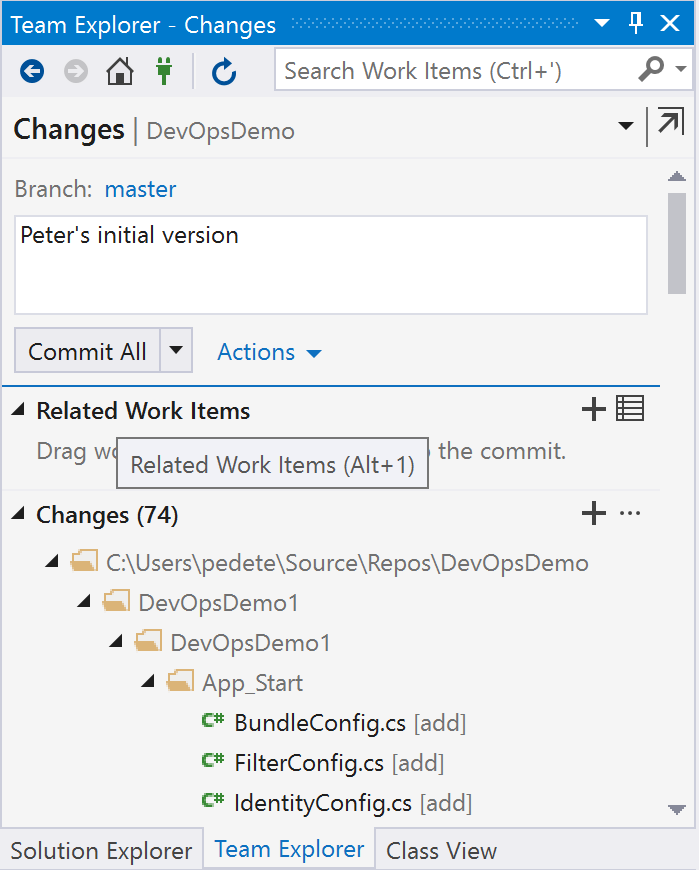 |
|-------------------------------------------------------------------------------------------------------------------------------------------------------------------------------|------------------------------------------------------------|
| 1.  Verify that the solution is visible in the Code tab of VSTS                                                                                                               | 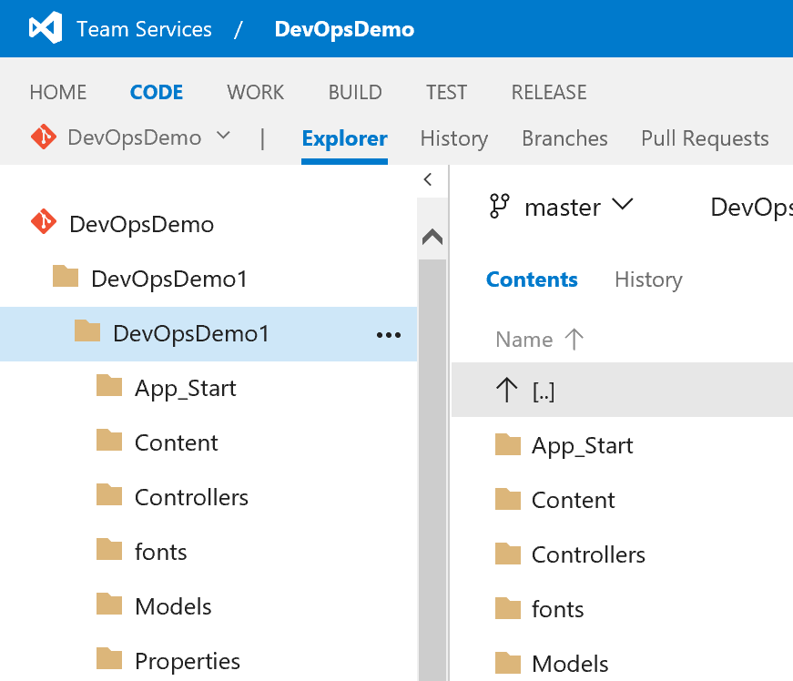 |

This completes the configuration of a new VSTS Project, syncing it offline to your development station, creating a new ASP.NET Web Application and upload the changes to VSTS.

Setup an Azure Service EndPoint to integrate with Visual Studio Team Services
-----------------------------------------------------------------------------

*Estimated time: 15 minutes*

**Note: This step should always be completed before starting the live demo. It basically shouldn’t be part of the live demo itself, although it depends on the overall session setup, where it might be of interest to emphasize the meaning of Azure Service Endpoint and how to create it. **

In this section, you will create an Azure Service Endpoint for the VSTS project you created earlier. This mainly involves running a PowerShell script to ease the configuration, and copy the outcoming parameters.

| 1.  From within the VSTS Project location, go to the **Managed Project** icon         | 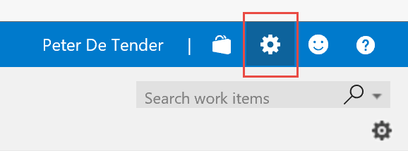                                            |
|---------------------------------------------------------------------------------------|-------------------------------------------------------------------------------------------------------|
| 1.  Select **Services**                                                               | 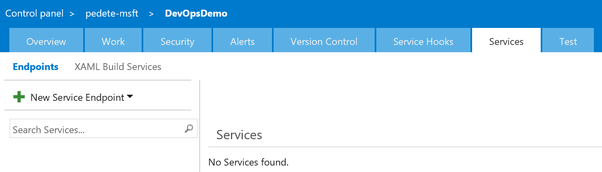                                            |
| 1.  Select **New Service Endpoint / Azure Resource Manager**                          | 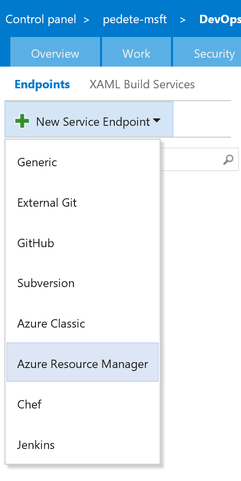                                            |
| 1.  Complete the fields with the data resulting from the following PowerSHell script: 
                                                                                        
     **Create\_Service\_Principal\_ID.ps1** in the DevOps content folder                | (Another source for this script is GitHub:                                                            
                                                                                                                                                                                                
                                                                                         <https://github.com/Microsoft/vsts-tasks/blob/master/Tasks/DeployAzureResourceGroup/SPNCreation.ps1>)  
                                                                                                                                                                                                
                                                                                         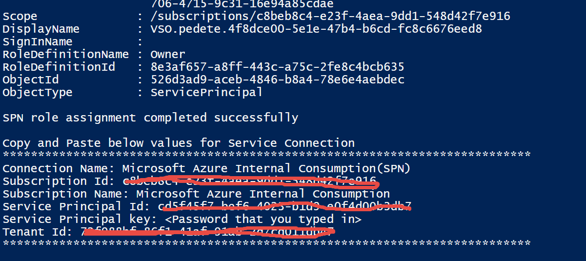                                             
                                                                                                                                                                                                
                                                                                         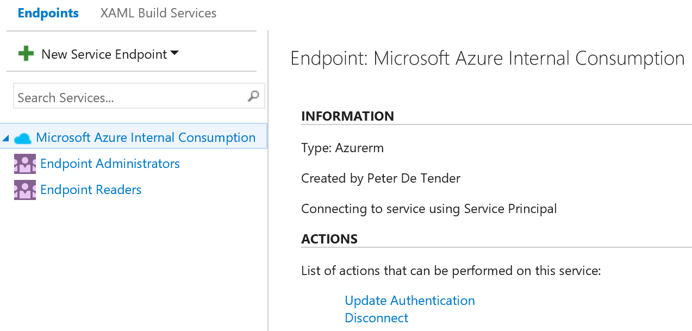                                             |
|                                                                                       |                                                                                                       |

This completes the creation of the Azure Service Endpoint for Visual Studio Team Services.

Use Visual Studio Team Services to create a new Build (Continuous Integration demo)
-----------------------------------------------------------------------------------

*Estimated time: 15 minutes*

**Note: This step should already been completed at least once before starting the live demo, to have a fallback plan. But of course, the full demo steps as described here, make up the live demo.**

In this section, you will create a “Build” to demo the Continuous Integration (CI) functionality out of the DevOps workshop

| 1.  From your VSTS project, select **Build**, and create a new build definition by selecting the “+” sign | 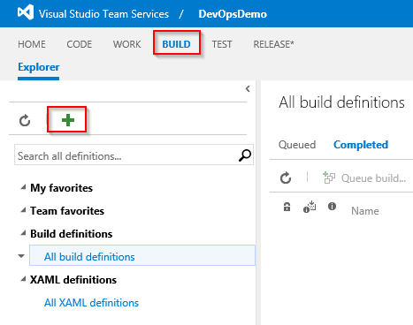 |
|-----------------------------------------------------------------------------------------------------------|------------------------------------------------------------|
| 1.  Since we’ve been working with Visual Studio, go ahead and select the Visual Studio Template.          | 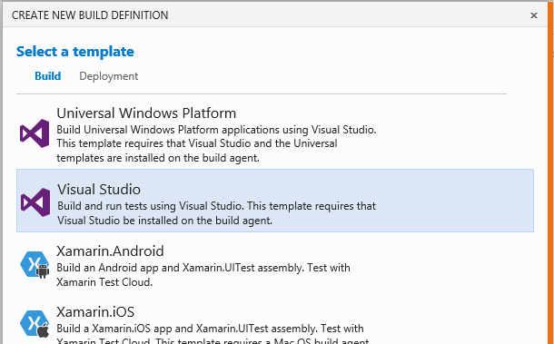 |

| 1.  On the Settings dialog leave everything as is, **make sure you activate the “Continuous integration”** and click “Create”                                                                      | 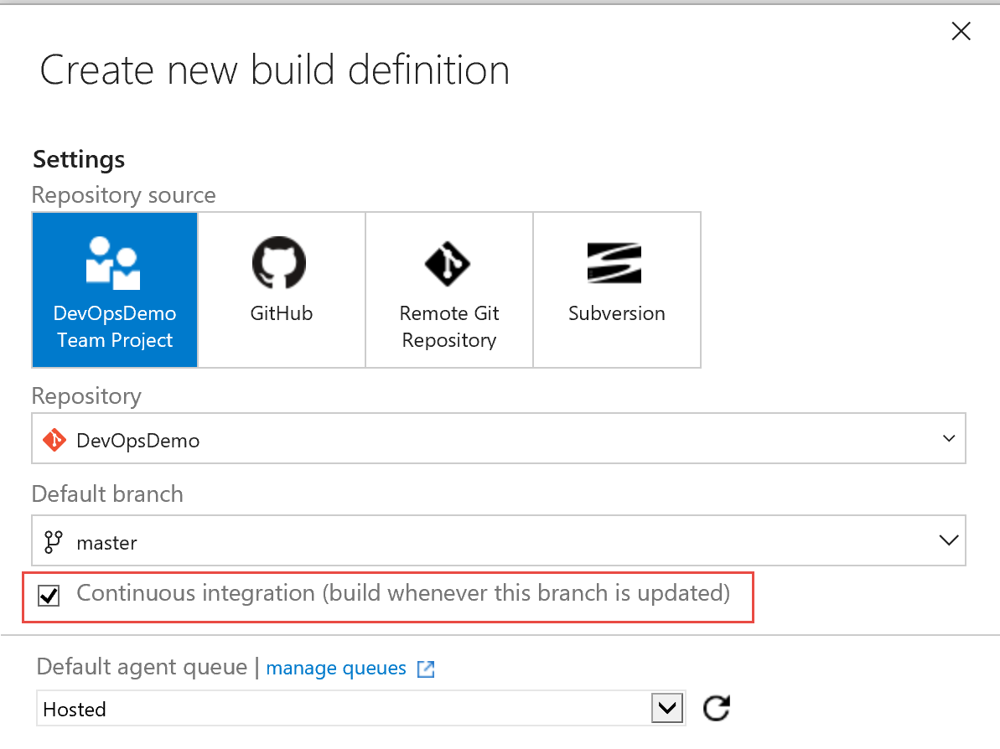 |
|----------------------------------------------------------------------------------------------------------------------------------------------------------------------------------------------------|------------------------------------------------------------|
| 1.  This template pre-bakes the steps that we need for a build.                                                                                                                                    
                                                                                                                                                                                                     
     However, since we will be deploying to a web app, we’ll need a web deployment package. To generate this .zip file, we need to **adjust the MSBuild Arguments** from the first step to include:  
                                                                                                                                                                                                     
     **/p:DeployOnBuild=true /p:WebPublishMethod=Package /p:PackageAsSingleFile=true /p:SkipInvalidConfigurations=true /p:PackageLocation="bin\\deploymentpackage"**                                 
                                                                                                                                                                                                     
     Next to that, we have to make a minor change in the Contents directory to be used in the **Copy Files to $(build.artifactstagingdirectory) step:**                                              
                                                                                                                                                                                                     
     **\*\*\\bin\\\*\***                                                                                                                                                                             
                                                                                                                                                                                                     
     Click Save and give your Build definition a title, ex. “DevOpsDemoBuild”                                                                                                                        | 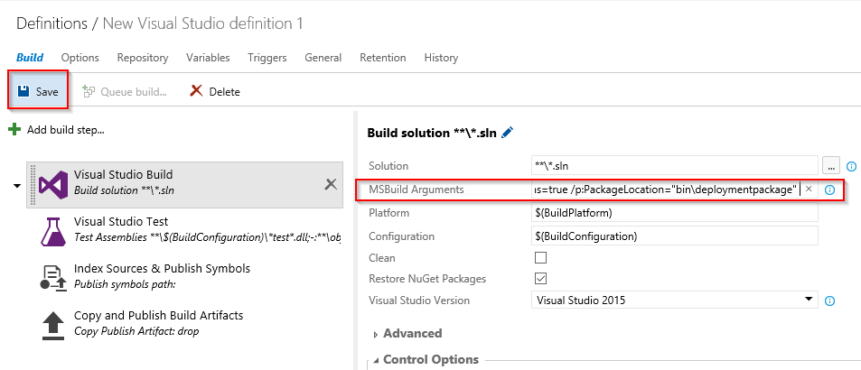 
                                                                                                                                                                                                                                                                  
                                                                                                                                                                                                      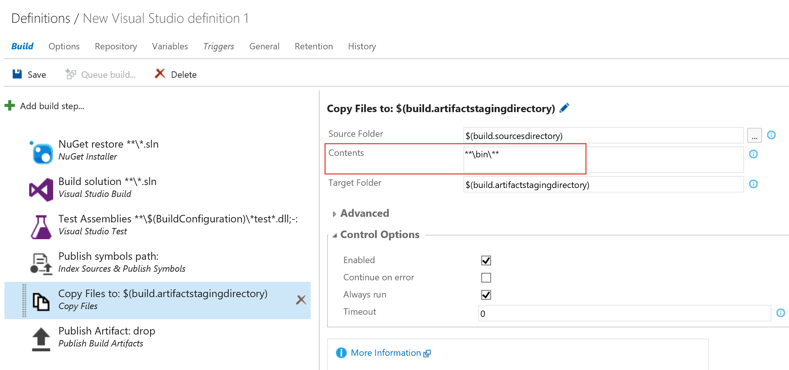  |
| 1.  Queue a new build and verify that the build completes successfully. (This could take up to 3 min in total)                                                                                     
                                                                                                                                                                                                     
     Clicking the “Artifacts” tab will give you the option to Explore files generated during the build, including our deployment package located at                                                  | 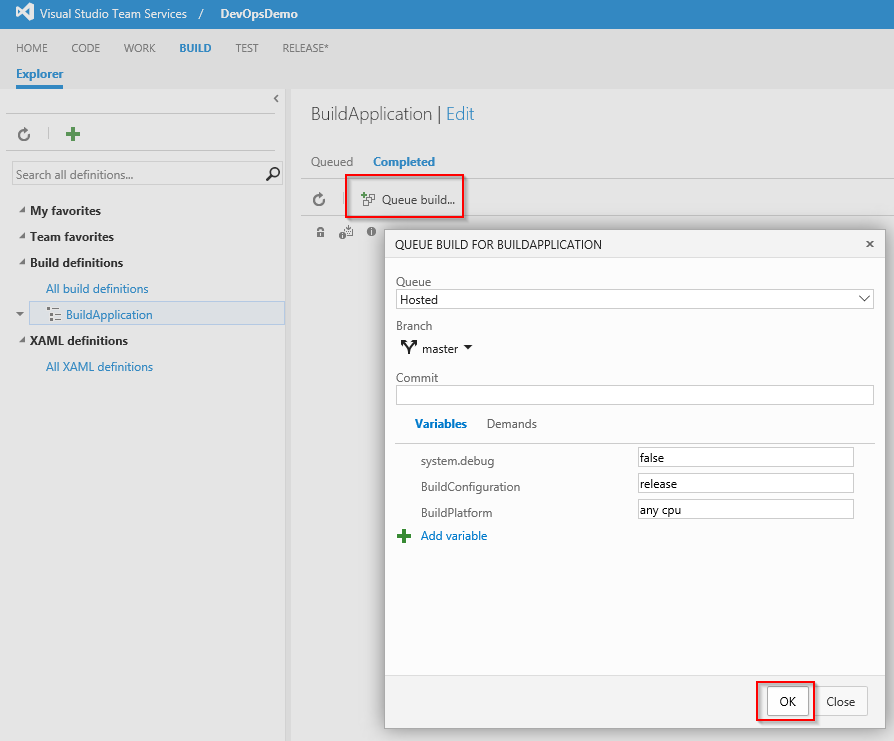 
                                                                                                                                                                                                                                                                  
                                                                                                                                                                                                      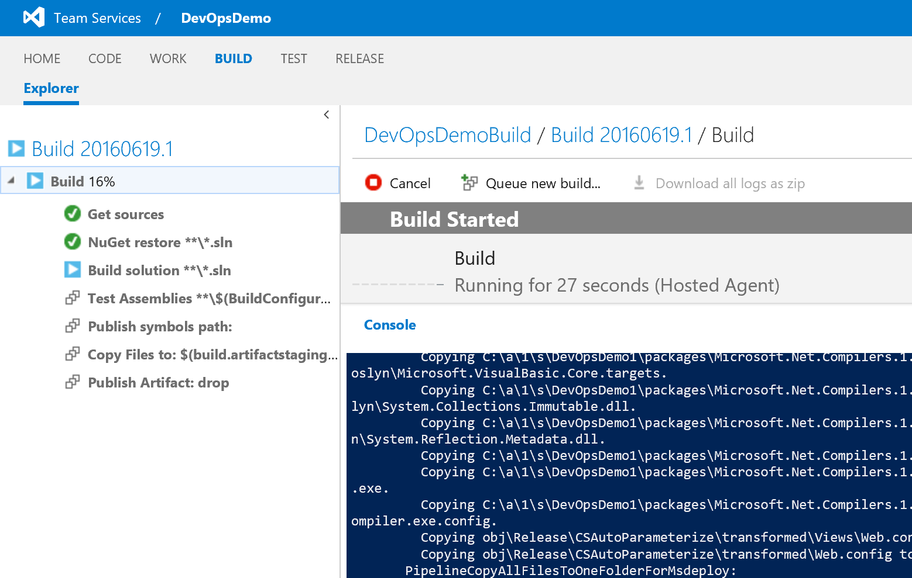  
                                                                                                                                                                                                                                                                  
                                                                                                                                                                                                      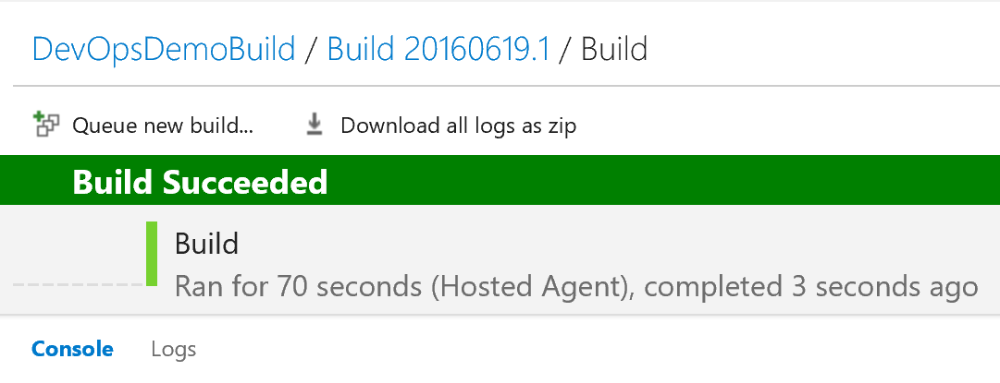  
                                                                                                                                                                                                                                                                  
                                                                                                                                                                                                      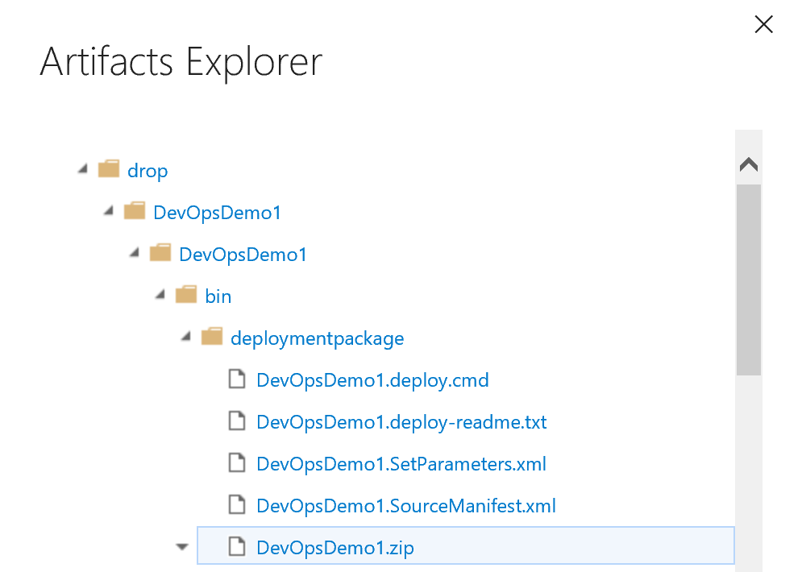  |

Use Visual Studio Team Services to create a new Release (Continuous Deployment demo)
------------------------------------------------------------------------------------

*Estimated time: 15 minutes*

**Note: This step should already have been completed at least once before starting the live demo, to have a fallback plan. But of course, the full demo steps as described here, make up the live demo.**

In this section, you will create a “Release” to demo the Continuous Deployment (CD) functionality out of the DevOps workshop

| 1.  From your VSTS project, select **Release**, and create a new Release definition by selecting the “+” sign 
                                                                                                                
 Select the **Empty** definition                                                                                
                                                                                                                
 and press Next                                                                                                 | 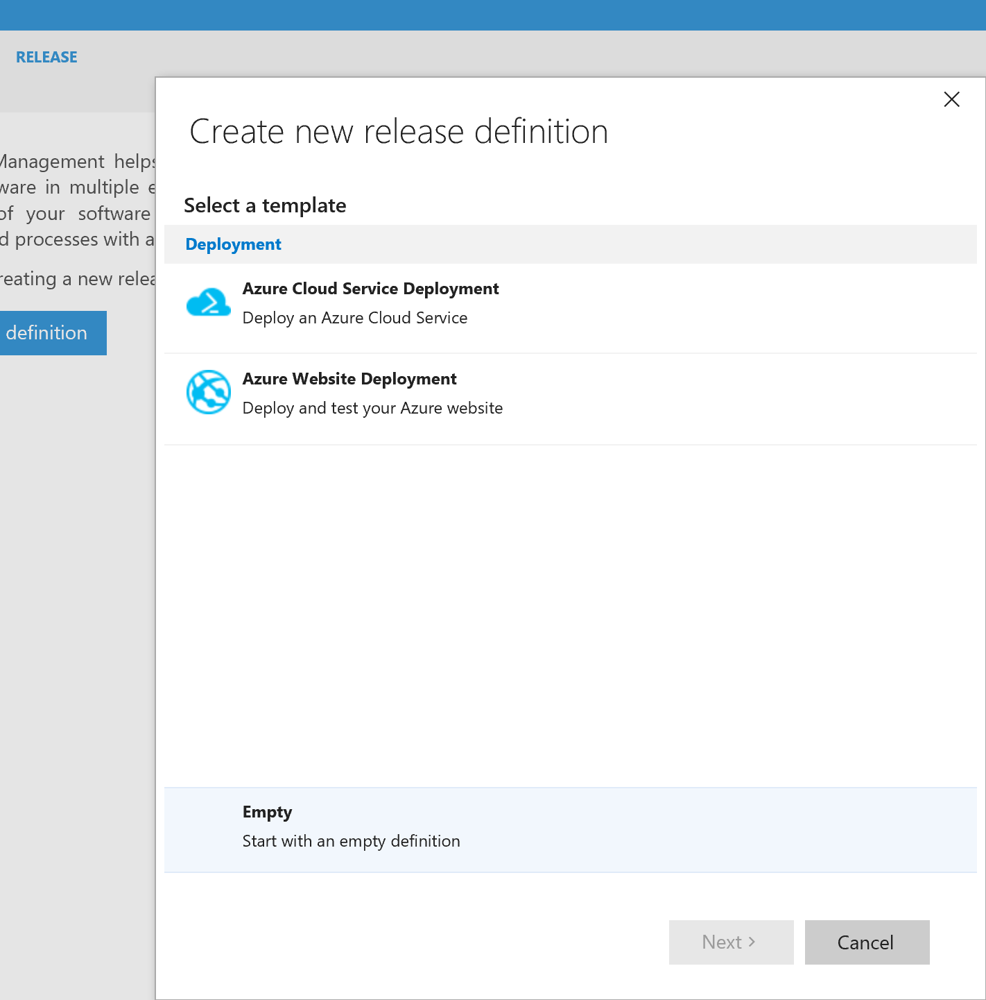 |
|---------------------------------------------------------------------------------------------------------------|------------------------------------------------------------|
| 1.  In the New Release Definition, make sure to select the **Continuous Deployment** option and press Create  | 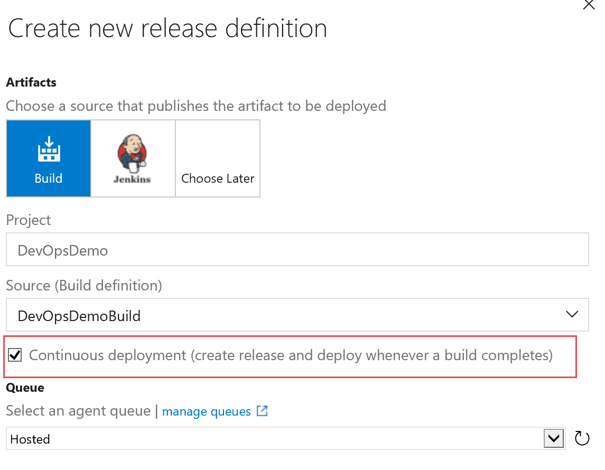 |
| 1.  This creates a New Release Definition Environment                                                         | 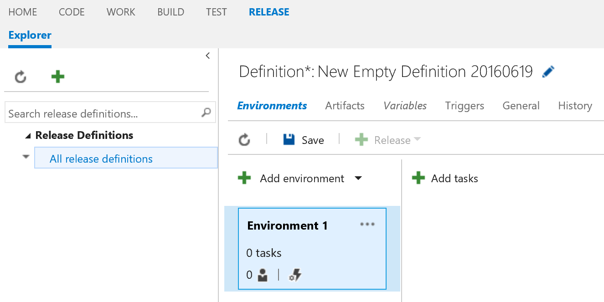 |
| 1.  Add a release task to this environment,                                                                   
     - by clicking the **+ Add Tasks** button.                                                                  
     - From the Add Tasks list, select **AzureRM Web App Deployment (Preview)                                   
     **- Press the **Add** button                                                                               
     - Press Close                                                                                              | 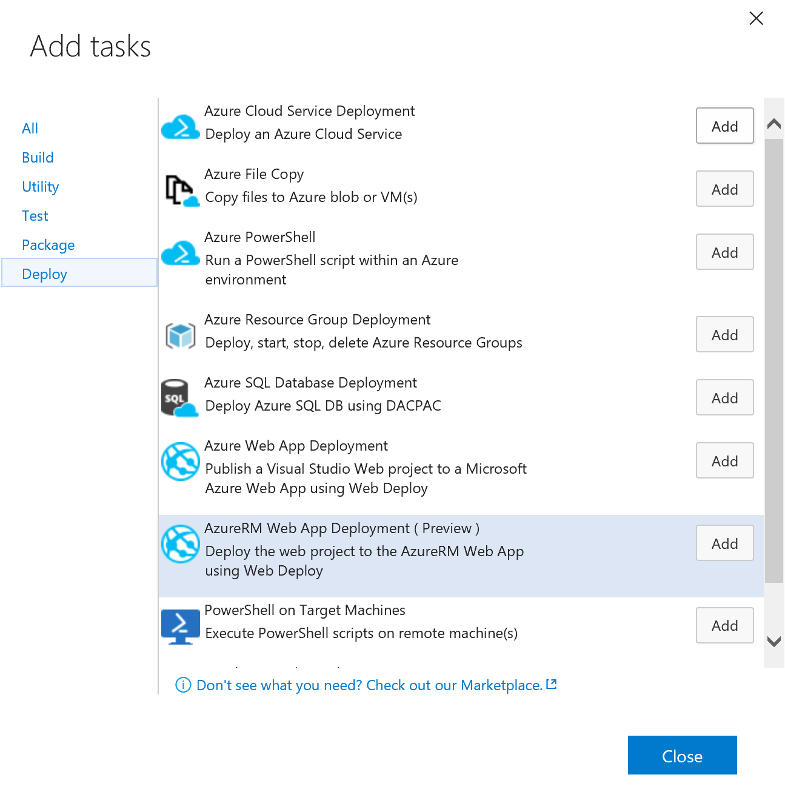 |

| 1.  This adds the **Deploy AzureRM Web App Deployment** to the tasks list                                                                                    | 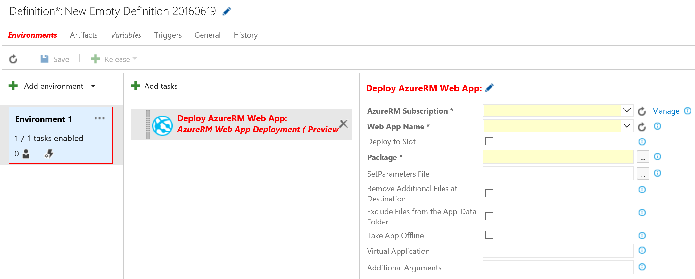                                                                                 |
|--------------------------------------------------------------------------------------------------------------------------------------------------------------|--------------------------------------------------------------------------------------------------------------------------------------------|
| 1.  Complete the fields as follows:                                                                                                                          
                                                                                                                                                               
 **Note: if the data in the fields does not get populated automatically, there is something wrong with the Azure ServicePoint creation (see previous steps)**  | 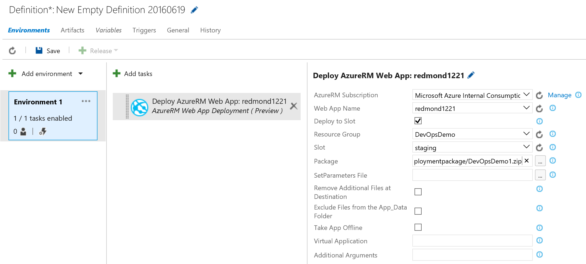                                                                                 
                                                                                                                                                                                                                                                                                                            
                                                                                                                                                                -   AzureRM Subscription = your Azure subscription                                                                                          
                                                                                                                                                                                                                                                                                                            
                                                                                                                                                                -   WebApp Name = The name of the Web App, as you defined in the ARM Template parameters during the Visual Studio deployment in Exercise 1  
                                                                                                                                                                                                                                                                                                            
                                                                                                                                                                -   **Activate the “Deploy to Slot”** option                                                                                                
                                                                                                                                                                                                                                                                                                            
                                                                                                                                                                -   Enter **Staging** as slot name (is defined like that during the ARM Template deployment)                                                
                                                                                                                                                                                                                                                                                                            
                                                                                                                                                                -   Package = browse to the **&lt;package&gt;.zip** file, which has been created in the Build step before                                   |
| 1.  Rename the Environment to “Staging”                                                                                                                      
     (Select Environment 1, which turns this field white… start typing)                                                                                        | 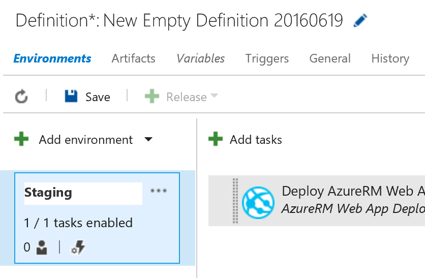                                                                                 |

| 1.  With our test environment configured, we now need to setup a second environment for production Click the …” and select the “**Clone environment**”.          
     This shows the Add new environment popup window. Accept the default values and press the **Create** button                                                    | 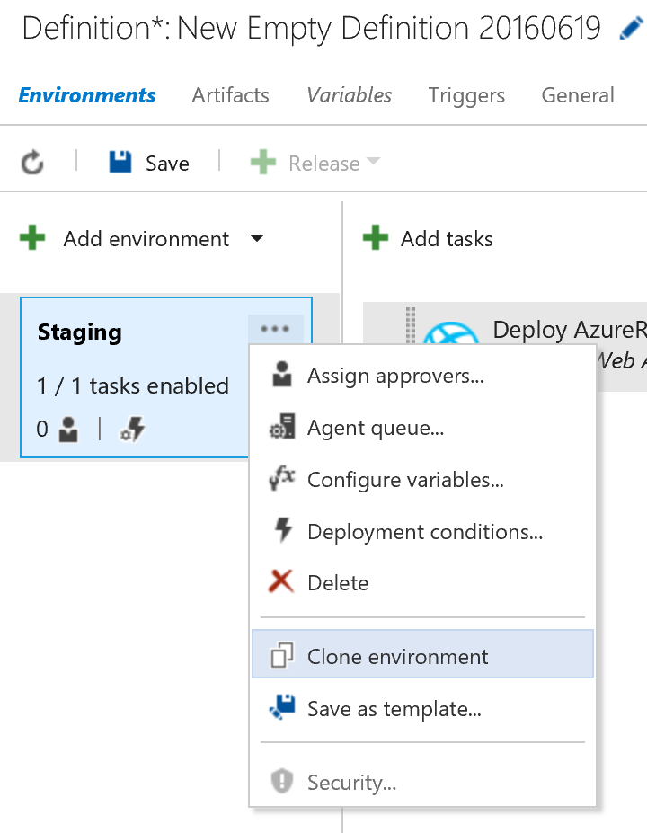 
                                                                                                                                                                                                                                
                                                                                                                                                                    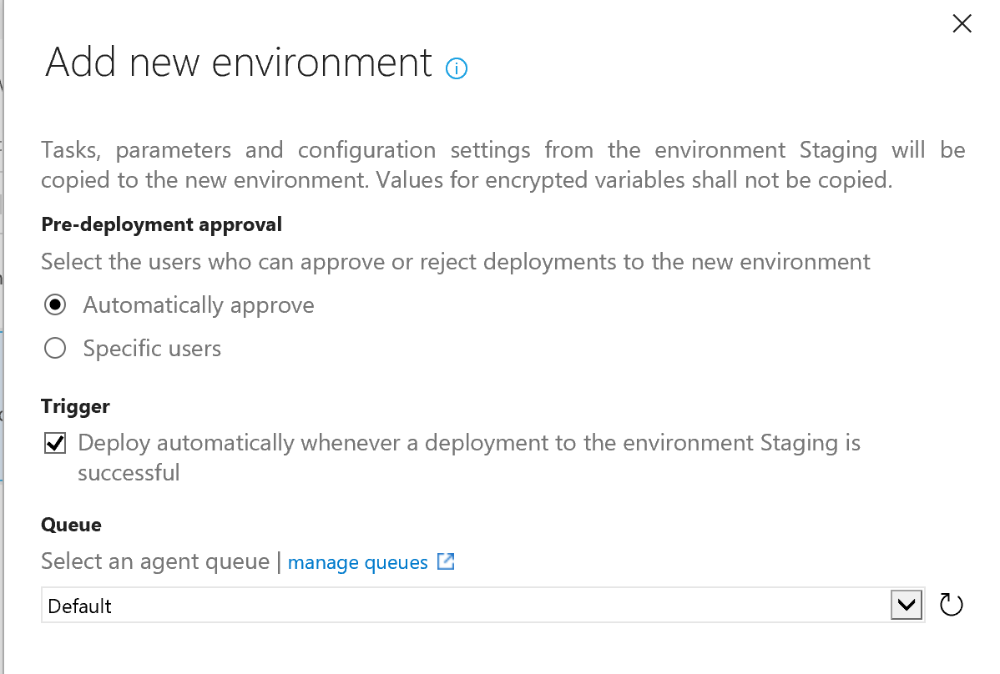  |
|------------------------------------------------------------------------------------------------------------------------------------------------------------------|------------------------------------------------------------|
| 1.  Another way to create a second environment, is again selecting **Add Environment**, **Create New Environment**, and selecting **AzureRM Web App Deployment** 
     Populate the fields as shown in the screenshot                                                                                                                | 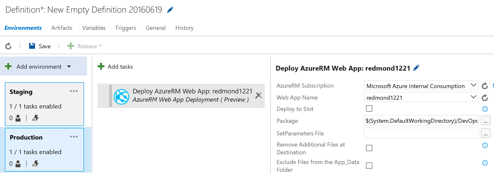 |

| 1.  **Save** the release definition, by pressing the **Save** button. This shows the Definition in the left hand column                                        | 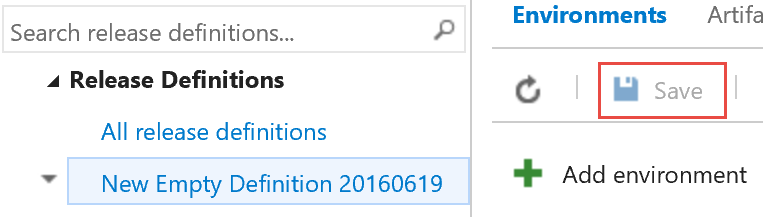 |
|----------------------------------------------------------------------------------------------------------------------------------------------------------------|------------------------------------------------------------|
| 1.  In this next step, we are to create a new **Release**, based on the previously created Release Defintion                                                   
     - select the Release Definition in the left column; Press the **+ Release** / **Create Release** option in the menu                                         
                                                                                                                                                                 
     Select the (Build) version as created in the previous build lab, accept the other default values for staging and production releases, and press **Create**  | 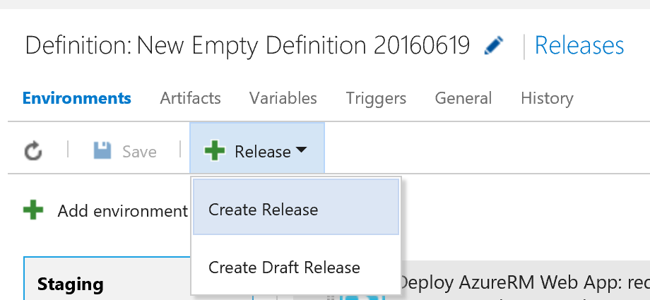 
                                                                                                                                                                                                                              
                                                                                                                                                                  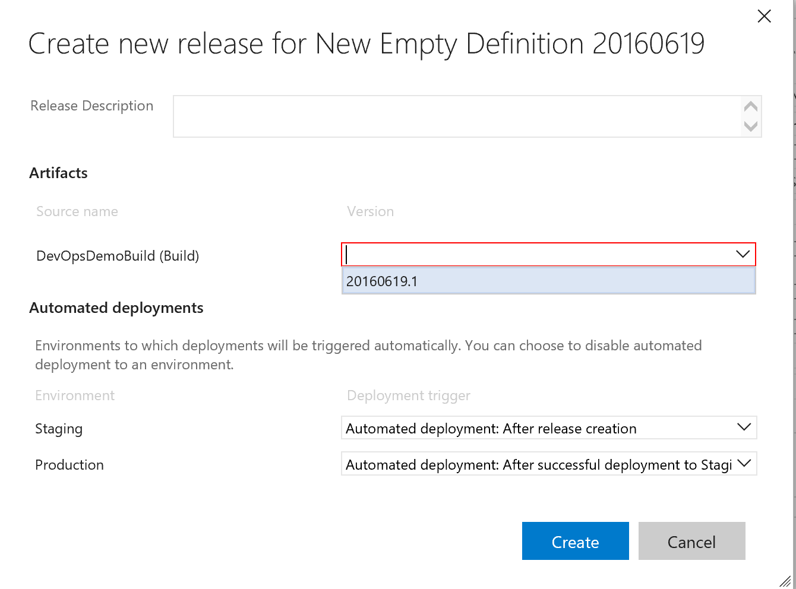  |
| 1.  The **Release** has been created. Select the **&lt;release&gt;** from the menu                                                                             | 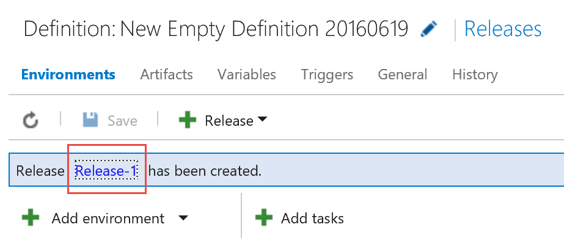  |

| 1.  This shows the details and progress of the release | 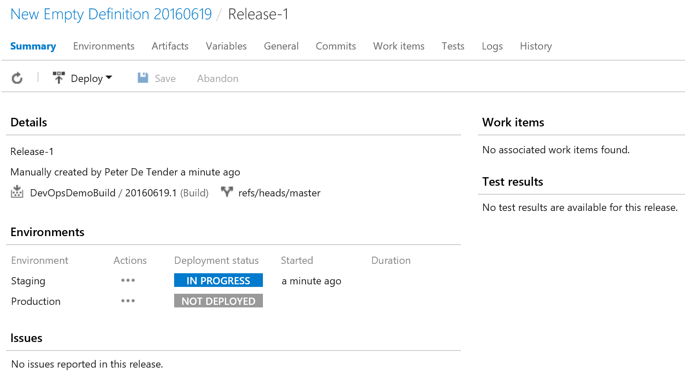 |
|--------------------------------------------------------|------------------------------------------------------------|
| 1.  Select the **Logs** section in the top menu        | 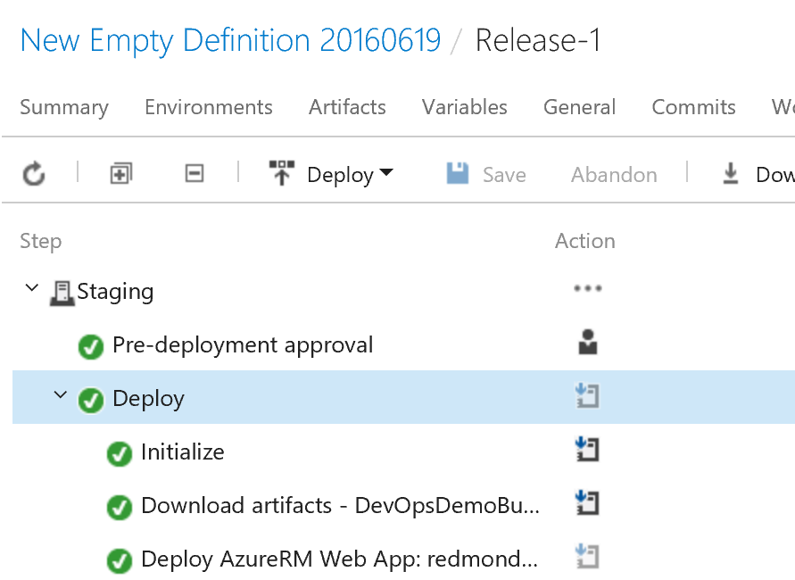 |
| 1.  Wait for the releases to be finished successfully. | 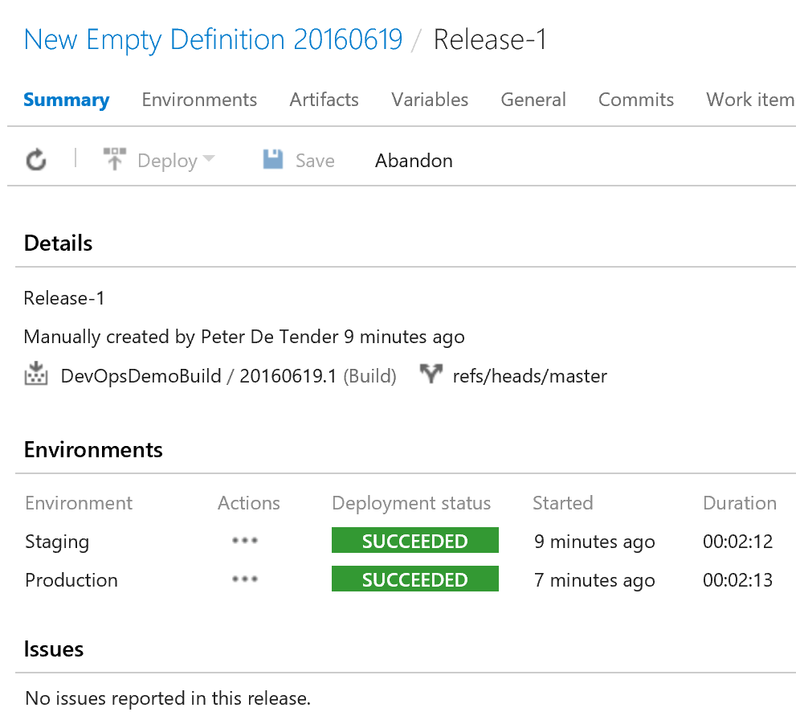 |

Clean Up
--------

To clean up this environment delete the Azure resource group and VSTS project you created in the Setup section.
